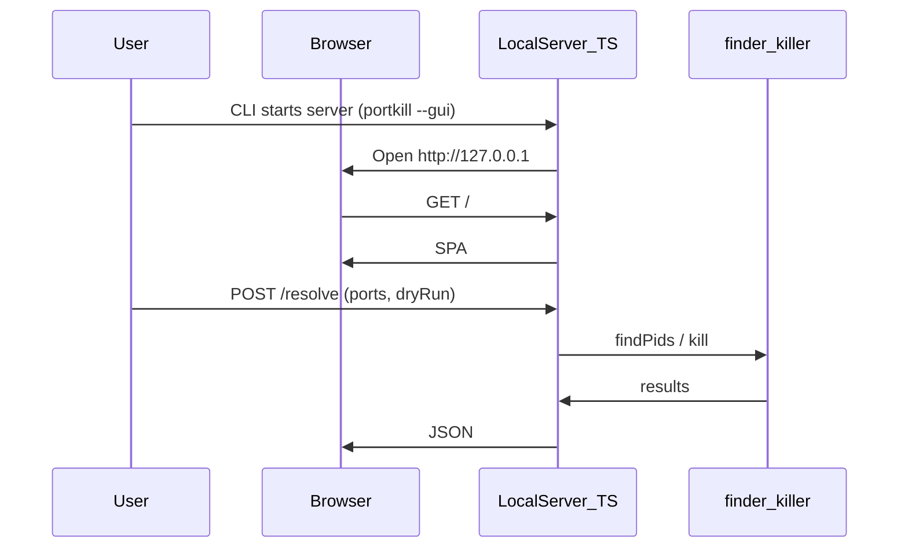

# portkill — Product Requirements Document (PRD)

**Version:** 0.4.0  
**Status:** Draft  
**Date:** 2026-03-22

---

## 1. Summary

`portkill` is a CLI tool that terminates processes listening on given port(s) in a single command; an optional lightweight browser UI may be added later. It is aimed at developers who hit “port already in use” errors. It is written in TypeScript, runs on Node.js, and is distributed via Homebrew.

---

## 2. Problem

Every developer working locally eventually sees:

```
Error: listen EADDRINUSE: address already in use :::3000
```

Existing approaches fall short because:

- `lsof -ti:3000 | xargs kill -9` — hard to remember, slow to type
- `fuser -k 3000/tcp` — not available by default on macOS
- Activity Monitor / Task Manager — too many steps, breaks terminal flow
- Manual PID lookup — unnecessary friction across `lsof`, `ps`, and `kill`

---

## 3. Target users

- Developers at any level doing local development
- macOS and Linux users (primary: macOS + Homebrew)
- People who prefer a terminal-first workflow

---

## 4. Goals

| # | Goal |
| --- | --- |
| 1 | Kill a single port in one command: `portkill 3000` |
| 2 | Kill multiple ports at once: `portkill 3000 8080 5432` |
| 3 | Tell the user which process was killed |
| 4 | Installable via Homebrew (`brew install`) |
| 5 | Work reliably on macOS and Linux |

### Out of scope (v0.1.0)

- Windows support
- GUI (simple web UI is a later release; see §5.5)
- Port monitoring / long-running watch
- Process whitelist / blacklist
- Config files

---

## 5. Features

### 5.1 Basic usage

```bash
portkill <port> [port2] [range] ...
```

**Examples:**

```bash
portkill 3000              # single port
portkill 3000 8080         # multiple ports
portkill 3000-3005         # inclusive port range (v0.3+)
portkill 3000 --force      # kill without confirmation
portkill 3000 --dry-run    # show what would be killed; do not kill
```

### 5.2 Output format

On success:

```
✔ Port 3000 → killed (node, PID 12345)
```

When no process is listening:

```
ℹ Port 8080 → no process found
```

On error:

```
✖ Port 5432 → permission denied (try with sudo)
```

### 5.3 Flags

| Flag | Short | Description |
| --- | --- | --- |
| `--force` | `-f` | Do not prompt for confirmation |
| `--dry-run` | `-n` | Show process info only; do not kill |
| `--signal <SIG>` | `-s` | Signal to send (default: SIGTERM) |
| `--verbose` | `-v` | Verbose output |
| `--version` | | Print version |
| `--help` | `-h` | Help |

### 5.4 Exit codes

| Code | Meaning |
| --- | --- |
| `0` | Success (all ports handled) |
| `1` | General error |
| `2` | No process found on any requested port |
| `3` | Permission denied |

### 5.5 Simple GUI — design and TypeScript approach

**Goal:** A minimal UI that reuses the same `finder` / `killer` logic as the CLI, without heavy runtimes (no Electron/Tauri). **Not part of v0.1.0 MVP**; add after the CLI is stable.

**Suggested entry:** `portkill --gui` or subcommand `portkill gui` — starts a local HTTP server on `127.0.0.1` (fixed or ephemeral port), opens the system browser; bind to localhost only (lower CSRF / network exposure risk).

**Technology (keep it light):**

| Layer | Choice | Rationale |
| --- | --- | --- |
| Frontend | TypeScript + HTML/CSS (Vite bundle or single page + modules) | Lightweight; no UI framework required |
| API | Thin `node:http` handler or minimal router in the same Node process | Import `core/` directly |
| Shared code | `src/core/*` plus optional thin `src/api/` | Single source of truth |

**Screen layout (wireframe):**

```
┌─────────────────────────────────────────────┐
│  portkill                          [close]  │
├─────────────────────────────────────────────┤
│  Port(s)   [ 3000, 8080        ]            │
│  ☐ Force (no prompt)   ☐ Dry-run            │
│  [ List ]  [ Kill ]                         │
├─────────────────────────────────────────────┤
│  Results                                    │
│  • 3000 → node (PID 12345)   [kill]         │
│  • 8080 → no process found                  │
│  ✖ 5432 → permission denied (try sudo)      │
└─────────────────────────────────────────────┘
```

**User flow:**



**Output:** Same semantics as the CLI (success / not found / permission); colors and icons optional (terminal styling e.g. chalk stays CLI-only; web uses CSS).

---

## 6. Technical architecture

### 6.1 Technology stack

| Layer | Choice | Rationale |
| --- | --- | --- |
| Language | TypeScript | Type safety, modern ecosystem |
| Runtime | Node.js ≥ 18 | LTS, straightforward Homebrew packaging |
| CLI | `commander` | Mature, small API |
| Build | `tsup` | Zero-config TypeScript bundler |
| Tests | `vitest` | Fast, TS-native |
| Lint | `eslint` + `prettier` | Consistency |
| GUI (optional) | TypeScript + Vite (or plain bundle) + `node:http` | Lightweight local UI, §5.5 |

### 6.2 Project layout

```
portkill/
├── src/
│   ├── index.ts          # CLI entry
│   ├── commands/
│   │   └── kill.ts       # Main kill command
│   ├── core/
│   │   ├── finder.ts     # Port → PID discovery
│   │   └── killer.ts     # Process termination
│   ├── gui/              # (optional, §5.5) local web UI
│   │   ├── server.ts     # 127.0.0.1 HTTP + static files
│   │   ├── app.ts        # Frontend logic (TS)
│   │   └── index.html    # Shell page
│   └── utils/
│       ├── output.ts     # Terminal formatting
│       └── platform.ts   # macOS / Linux detection
├── tests/
│   ├── finder.test.ts
│   └── killer.test.ts
├── dist/                 # build output (gitignored)
├── gui-dist/             # (optional) Vite output — gitignored
├── package.json
├── tsconfig.json
├── tsup.config.ts
├── vite.config.ts        # (optional) GUI bundle
└── README.md
```

### 6.3 Platform strategy

Port → PID mapping uses OS-specific commands:

| Platform | Command |
| --- | --- |
| macOS | `lsof -ti tcp:<port>` |
| Linux | `fuser <port>/tcp` or `/proc/net/tcp` |

Detection uses `process.platform`; abstraction lives in `platform.ts`.

---

## 7. Distribution plan (npm + Homebrew)

End-user installs are **out of scope for v0.1–v0.2**; both channels are targeted in **v0.3.0** (see §8). Order of operations: publish to **npm first** (Homebrew formula often consumes the npm tarball).

### 7.1 npm — `npm publish` and global install

| Step | Action |
| --- | --- |
| 1 | Confirm package name (`npm view @burakboduroglu/portkill`); unscoped `portkill` is blocked on npm (similar to `port-kill`). |
| 2 | Ensure `package.json` has correct `version`, `bin.portkill` → built `dist/index.js`, `files` (or `.npmignore`) so `dist/` ships. |
| 3 | `npm run build` and `npm test` (and `npm run test:coverage`) before release. |
| 4 | `npm login`; `npm publish` (`publishConfig.access: public` for this scoped package). |
| 5 | Verify: `npm i -g @burakboduroglu/portkill` then `portkill --version`; optional `npx @burakboduroglu/portkill --help`. |
| 6 | Tag release in Git (`vX.Y.Z`) aligned with `package.json` version. |

**v0.3 deliverable:** documented install path (`README` + registry page) and a repeatable release checklist.

### 7.2 Homebrew — tap and `brew install`

| Step | Action |
| --- | --- |
| 1 | (After npm) Note tarball URL and SHA256 from registry or release artifact. |
| 2 | Create a versioned GitHub release if you mirror artifacts there. |
| 3 | Open a `homebrew-portkill` (or user) tap repository. |
| 4 | Add formula `portkill.rb` (see §7.3). |
| 5 | Test: `brew tap <user>/portkill && brew install portkill` and `portkill --version`. |

**v0.3 deliverable:** tap URL in README; formula maintained alongside npm versions.

### 7.3 Example Homebrew formula

```ruby
class Portkill < Formula
  desc "Kill processes running on specified ports"
  homepage "https://github.com/<user>/portkill"
  url "https://registry.npmjs.org/@burakboduroglu/portkill/-/portkill-0.4.1.tgz"
  sha256 "<sha256>"
  license "MIT"

  depends_on "node"

  def install
    system "npm", "install", *std_npm_args
    bin.install_symlink Dir["#{libexec}/bin/*"]
  end

  test do
    system "#{bin}/portkill", "--version"
  end
end
```

---

## 8. Roadmap

### v0.1.0 — MVP

- [x] Single-port kill
- [x] Multi-port support
- [x] macOS support
- [x] `--dry-run` flag
- [x] `--force` flag
- [ ] Distribution (npm + Homebrew): deferred to **v0.3.0** (§7)

### v0.2.0

- [x] Linux support
- [x] `--signal` flag
- [x] Colored, formatted output (chalk)
- [x] Unit tests (≥ 80% coverage on `src/` except CLI entry)

### v0.3.0

- [x] Port ranges: `portkill 3000-3005` (inclusive; max 4096 ports per range token)
- [x] List listeners: `portkill --list`
- [x] **npm:** Package layout for registry (`files`, `prepublishOnly`); install docs for `npm i -g` / `npx` (see §7.1; run `npm publish` when ready)
- [x] **Homebrew:** formula in repo (`packaging/homebrew/portkill.rb`); maintainer creates a tap and updates `sha256` per release (see `docs/homebrew.md`, §7.2)

### v0.4.0 — Simple GUI

- [x] `portkill --gui`: HTTP server on **127.0.0.1** only + optional browser open
- [x] Single-page UI + JSON API (`/api/listeners`, `/api/resolve`); reuses `runKill` / `listAllTcpListeners` / `parsePortArguments`
- [x] List all listeners, dry-run and kill (browser confirm) aligned with §5.5 intent

---

## 9. Success criteria

| Metric | Target |
| --- | --- |
| First install → first successful use | < 2 minutes |
| Command runtime | < 500ms |
| macOS + Linux compatibility | 100% |
| Test coverage | ≥ 80% |
| npm global / `npx` install | Documented; package published to registry |
| Homebrew tap install | Works without friction (v0.3) |

---

## 10. Risks

| Risk | Likelihood | Mitigation |
| --- | --- | --- |
| `lsof` / `fuser` output differs by OS | Medium | Platform abstraction layer |
| Privileged ports (< 1024) need root | High | Clear error + suggest `sudo` |
| Node version mismatch | Low | Enforce `>=18` in `engines` |
| npm package name collision | Done | Published as `@burakboduroglu/portkill` (unscoped blocked vs `port-kill`) |
| Local GUI server bound to non-loopback | Low | Listen on loopback (`127.0.0.1` + `::1`); document in README |
