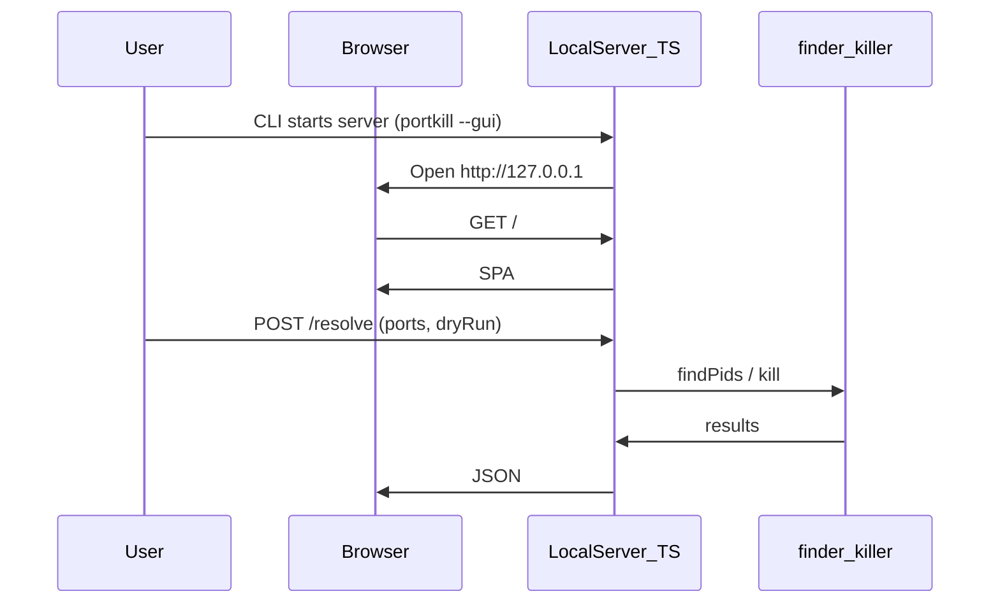

# portkill — Product Requirements Document (PRD)

**Version:** 0.4.x (see `package.json`; ships as `@burakboduroglu/portkill` on npm)  
**Status:** Active (current scope shipped)  
**Date:** 2026-03-22

---

## 1. Summary

`portkill` is a CLI tool that terminates processes listening on given TCP port(s) in one command, with a **local web UI** (`--gui`, loopback-only) that reuses the same kill/list logic. It is aimed at developers who hit “port already in use” errors. It is written in TypeScript, runs on Node.js ≥ 18, and is distributed only via **npm** as `@burakboduroglu/portkill`.

---

## 2. Problem

Every developer working locally eventually sees:

```
Error: listen EADDRINUSE: address already in use :::3000
```

Existing approaches fall short because:

- `lsof -ti:3000 | xargs kill -9` — hard to remember, slow to type
- `fuser -k 3000/tcp` — not available by default on macOS
- Activity Monitor / Task Manager — too many steps, breaks terminal flow
- Manual PID lookup — unnecessary friction across `lsof`, `ps`, and `kill`

---

## 3. Target users

- Developers at any level doing local development
- macOS and Linux users (primary: macOS + Node/npm)
- People who prefer a terminal-first workflow

---

## 4. Goals

| # | Goal |
| --- | --- |
| 1 | Kill a single port in one command: `portkill 3000` |
| 2 | Kill multiple ports at once: `portkill 3000 8080 5432` |
| 3 | Tell the user which process was killed |
| 4 | Installable via npm (`npm i -g @burakboduroglu/portkill`) |
| 5 | Work reliably on macOS and Linux |
| 6 | Local web UI (`--gui`) with the same kill/list semantics as the CLI |

### Out of scope (not planned)

- Windows support
- Port monitoring / long-running watch
- Process whitelist / blacklist
- Config files

---

## 5. Features

### 5.1 Basic usage

```bash
portkill <port> [port2] [range] ...
```

**Examples:**

```bash
portkill 3000              # single port
portkill 3000 8080         # multiple ports
portkill 3000-3005         # inclusive port range (v0.3+)
portkill 3000 --force      # kill without confirmation
portkill 3000 --dry-run    # show what would be killed; do not kill
```

### 5.2 Output format

On success:

```
✔ Port 3000 → killed (node, PID 12345)
```

When no process is listening:

```
ℹ Port 8080 → no process found
```

On error:

```
✖ Port 5432 → permission denied (try with sudo)
```

### 5.3 Flags

| Flag | Short | Description |
| --- | --- | --- |
| `--force` | `-f` | Do not prompt for confirmation |
| `--dry-run` | `-n` | Show process info only; do not kill |
| `--signal <SIG>` | `-s` | Signal to send (default: SIGTERM) |
| `--verbose` | `-v` | Verbose output |
| `--list` | `-l` | List all TCP listeners (no port arguments) |
| `--gui` | | Local web UI on loopback (no port arguments or `--list`) |
| `--version` | | Print version |
| `--help` | `-h` | Help |

### 5.4 Exit codes

| Code | Meaning |
| --- | --- |
| `0` | Success (all ports handled) |
| `1` | General error |
| `2` | No process found on any requested port |
| `3` | Permission denied |

### 5.5 Simple GUI — shipped behavior

**Implemented:** A minimal UI that reuses the same `finder` / `killer` paths as the CLI, without Electron/Tauri — embedded HTML/CSS/TS in `src/gui/` (see implementation doc).

**Entry:** `portkill --gui` — starts a local HTTP server on **127.0.0.1** / **::1** (ephemeral port), optionally opens the system browser; loopback only.

**Technology:**

| Layer | Choice | Rationale |
| --- | --- | --- |
| Frontend | Embedded single-page UI (`index-html.ts`) | No separate Vite bundle in the shipped build |
| API | `node:http` in-process | JSON routes; imports shared command helpers |
| Shared code | `runKill`, `listAllTcpListeners`, `parsePortArguments` | Same outcomes as CLI |

**Screen layout (wireframe):**

```
┌─────────────────────────────────────────────┐
│  portkill                          [close]  │
├─────────────────────────────────────────────┤
│  Port(s)   [ 3000, 8080        ]            │
│  ☐ Force (no prompt)   ☐ Dry-run            │
│  [ List ]  [ Kill ]                         │
├─────────────────────────────────────────────┤
│  Results                                    │
│  • 3000 → node (PID 12345)   [kill]         │
│  • 8080 → no process found                  │
│  ✖ 5432 → permission denied (try sudo)      │
└─────────────────────────────────────────────┘
```

**User flow:**



**Output:** Same semantics as the CLI (success / not found / permission); colors and icons optional (terminal styling e.g. chalk stays CLI-only; web uses CSS).

---

## 6. Technical architecture

### 6.1 Technology stack

| Layer | Choice | Rationale |
| --- | --- | --- |
| Language | TypeScript | Type safety, modern ecosystem |
| Runtime | Node.js ≥ 18 | LTS; install via npm |
| CLI | `commander` | Mature, small API |
| Build | `tsup` | Zero-config TypeScript bundler |
| Tests | `vitest` | Fast, TS-native |
| Lint | `eslint` + `prettier` | Consistency |
| GUI | Embedded UI + `node:http` | Local UI, §5.5 |

### 6.2 Project layout

```
portkill/
├── src/
│   ├── index.ts          # CLI entry
│   ├── commands/
│   │   └── kill.ts       # Main kill command
│   ├── core/
│   │   ├── finder.ts     # Port → PID discovery
│   │   └── killer.ts     # Process termination
│   ├── gui/              # §5.5 local web UI
│   │   ├── server.ts     # loopback HTTP + routes
│   │   ├── index-html.ts # embedded page + client logic
│   │   └── open-browser.ts
│   └── utils/
│       ├── output.ts     # Terminal formatting
│       └── platform.ts   # macOS / Linux detection
├── tests/
│   ├── finder.test.ts
│   ├── killer.test.ts
│   ├── kill-command.test.ts
│   ├── list-command.test.ts
│   ├── lister.test.ts
│   ├── lister-all.test.ts
│   ├── parse-ports.test.ts
│   ├── platform.test.ts
│   ├── output.test.ts
│   ├── exit-code.test.ts
│   └── gui-server.test.ts
├── dist/                 # build output (gitignored)
├── package.json
├── tsconfig.json
├── tsup.config.ts
└── README.md
```

### 6.3 Platform strategy

Port → PID mapping uses OS-specific commands:

| Platform | Command |
| --- | --- |
| macOS | `lsof -ti tcp:<port>` |
| Linux | `fuser <port>/tcp` or `/proc/net/tcp` |

Detection uses `process.platform`; abstraction lives in `platform.ts`.

---

## 7. Distribution plan (npm)

End-user installs ship through **npm** only, as `@burakboduroglu/portkill` (unscoped `portkill` is blocked on the registry as too similar to `port-kill`).

### 7.1 npm — `npm publish` and global install

| Step | Action |
| --- | --- |
| 1 | Confirm package name (`npm view @burakboduroglu/portkill`); unscoped `portkill` is blocked on npm (similar to `port-kill`). |
| 2 | Ensure `package.json` has correct `version`, `bin.portkill` → built `dist/index.js`, `files` (or `.npmignore`) so `dist/` ships. |
| 3 | `npm run build` and `npm test` (and `npm run test:coverage`) before release. |
| 4 | `npm login`; `npm publish` (`publishConfig.access: public` for this scoped package). |
| 5 | Verify: `npm i -g @burakboduroglu/portkill` then `portkill --version`; optional `npx @burakboduroglu/portkill --help`. |
| 6 | Tag release in Git (`vX.Y.Z`) aligned with `package.json` version. |

**Deliverable:** documented install path (`README` + registry page) and a repeatable release checklist (`docs/RELEASE.md`).

---

## 8. Shipped capabilities

All of the following are implemented and maintained in the current codebase:

- CLI: single and multiple ports, inclusive ranges (max 4096 ports per range token), `--dry-run`, `--force`, `--signal`, `--list`, `--verbose`, `--version`, `--help`
- macOS and Linux (`lsof` / `fuser` / `/proc` as applicable); clear error on unsupported platforms
- Terminal output (chalk); exit codes per §5.4
- **`--gui`:** loopback HTTP server, embedded UI, `/api/listeners` and `/api/resolve`; browser confirm for kill; same semantics as CLI
- npm package `@burakboduroglu/portkill` (`files`, `prepublishOnly`, public scoped publish); install docs in README

---

## 9. Success criteria

| Metric | Target |
| --- | --- |
| First install → first successful use | < 2 minutes |
| Command runtime | < 500ms |
| macOS + Linux compatibility | 100% |
| Test coverage | ≥ 80% |
| npm global / `npx` install | Documented; package published to registry |

---

## 10. Risks

| Risk | Likelihood | Mitigation |
| --- | --- | --- |
| `lsof` / `fuser` output differs by OS | Medium | Platform abstraction layer |
| Privileged ports (< 1024) need root | High | Clear error + suggest `sudo` |
| Node version mismatch | Low | Enforce `>=18` in `engines` |
| npm package name collision | Done | Published as `@burakboduroglu/portkill` (unscoped blocked vs `port-kill`) |
| Local GUI server bound to non-loopback | Low | Listen on loopback (`127.0.0.1` + `::1`); document in README |
