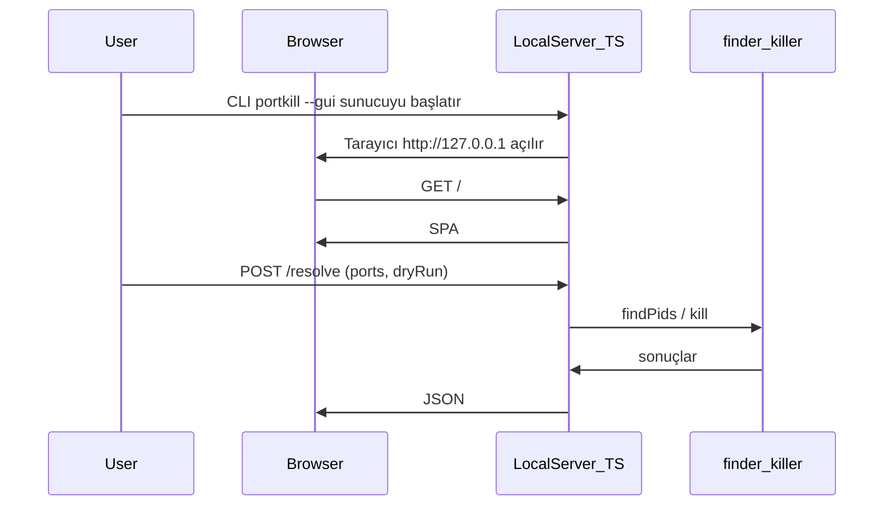

# portkill — Ürün gereksinim belgesi (PRD)

**Versiyon:** 0.1.0  
**Durum:** Draft  
**Tarih:** 2026-03-22

---

## 1. Özet

`portkill`, belirtilen port(lar)ı dinleyen process'leri tek komutla sonlandıran bir CLI aracıdır; isteğe bağlı olarak çok hafif bir tarayıcı arayüzü de sunulabilir. "Port already in use" hatasıyla karşılaşan her developer'ın hayatını kolaylaştırmak için tasarlanmıştır. TypeScript ile yazılır, Node.js üzerinde çalışır ve Homebrew üzerinden dağıtılır.

---

## 2. Problem

Lokal geliştirme ortamında çalışan her developer şu senaryoyla karşılaşır:

```
Error: listen EADDRINUSE: address already in use :::3000
```

Mevcut çözümler aşağıdaki nedenlerle yetersizdir:

- `lsof -ti:3000 | xargs kill -9` — Ezberlemesi zor, yazması yavaş
- `fuser -k 3000/tcp` — macOS'ta varsayılan olarak gelmiyor
- Activity Monitor / Task Manager — Çok fazla adım, terminal flow'unu kiriyor
- Manuel PID bulma — `lsof`, `ps`, `kill` üçlüsü gereksiz yük

---

## 3. Hedef Kullanıcı

- Lokal geliştirme yapan her seviyeden yazılım geliştirici
- macOS ve Linux kullananlar (birincil hedef: macOS + Homebrew kullanıcıları)
- Terminal-first workflow tercih edenler

---

## 4. Hedefler

| #   | Hedef                                                                 |
| --- | --------------------------------------------------------------------- |
| 1   | Bir portu tek komutla sonlandırmak: `portkill 3000`                   |
| 2   | Birden fazla portu aynı anda sonlandırmak: `portkill 3000 8080 5432`  |
| 3   | Kullanıcıya hangi process'in öldürüldüğünü bildirmek                 |
| 4   | Homebrew üzerinden `brew install` ile kurulabilir olmak             |
| 5   | macOS ve Linux'ta sorunsuz çalışmak                                   |

### Hedef Dışında Kalanlar (v0.1.0)

- Windows desteği
- GUI arayüzü (basit web GUI ayrı sürümde; bkz. §5.5)
- Port izleme / monitoring
- Process whitelist/blacklist
- Config dosyası

---

## 5. Özellikler

### 5.1 Temel Kullanım

```bash
portkill <port> [port2] [port3] ...
```

**Örnekler:**

```bash
portkill 3000              # Tek port
portkill 3000 8080         # Birden fazla port
portkill 3000 --force      # Onay sormadan öldür
portkill 3000 --dry-run    # Neyin öldürüleceğini göster, öldürme
```

### 5.2 Çıktı Formatı

Başarılı durumda:

```
✔ Port 3000 → killed (node, PID 12345)
```

Process bulunamadığında:

```
ℹ Port 8080 → no process found
```

Hata durumunda:

```
✖ Port 5432 → permission denied (try with sudo)
```

### 5.3 Flag'ler

| Flag               | Kısaltma | Açıklama                               |
| ------------------ | -------- | -------------------------------------- |
| `--force`          | `-f`     | Onay sormadan öldür                    |
| `--dry-run`        | `-n`     | Sadece process bilgisini göster, öldürme |
| `--signal <SIG>`   | `-s`     | Kullanılacak sinyal (varsayılan: SIGTERM) |
| `--verbose`        | `-v`     | Detaylı çıktı                          |
| `--version`        |          | Versiyon bilgisi                       |
| `--help`           | `-h`     | Yardım mesajı                          |

### 5.4 Exit Kodları

| Kod | Anlam                         |
| --- | ----------------------------- |
| `0` | Başarılı (tüm portlar işlendi) |
| `1` | Genel hata                    |
| `2` | Hiçbir port bulunamadı        |
| `3` | İzin hatası (permission denied) |

### 5.5 Basit GUI — tasarım ve TypeScript yaklaşımı

Amaç: CLI ile aynı `finder` / `killer` mantığını kullanan, kurulumu ağır olmayan (Electron/Tauri yok) minimal bir arayüz. **v0.1.0 MVP dışında**; CLI stabil olduktan sonra eklenebilir.

**Giriş noktası önerisi:** `portkill --gui` veya alt komut `portkill gui` — yerel HTTP sunucusu (`127.0.0.1` üzerinde rastgele veya sabit port) başlar, sistem tarayıcısı açılır; sadece localhost’a bağlanır (CSRF / ağ maruziyeti riski düşük).

**Teknoloji (basit tutmak için):**

| Katman        | Seçim | Gerekçe |
| ------------- | ----- | ------- |
| Ön yüz        | TypeScript + HTML/CSS (Vite ile derleme veya tek sayfa + modül) | Hafif, ekstra UI framework zorunlu değil |
| API           | Aynı Node sürecinde ince HTTP handler (`node:http`) veya minimal router | `core/` modülleri doğrudan import |
| Paylaşılan kod | `src/core/*` + isteğe bağlı ince `src/api/` katmanı | Tek doğruluk kaynağı |

**Ekran düzeni (wireframe):**

```
┌─────────────────────────────────────────────┐
│  portkill                          [kapat]  │
├─────────────────────────────────────────────┤
│  Port(lar)  [ 3000, 8080        ]           │
│  ☐ Force (onay sorma)   ☐ Dry-run           │
│  [ Listele ]  [ Sonlandır ]                  │
├─────────────────────────────────────────────┤
│  Sonuçlar                                   │
│  • 3000 → node (PID 12345)   [öldür]       │
│  • 8080 → no process found                  │
│  ✖ 5432 → permission denied (sudo önerisi)   │
└─────────────────────────────────────────────┘
```

**Kullanıcı akışı:**



**Çıktı:** CLI ile aynı anlamlı mesajlar (başarı / bulunamadı / izin hatası); renk ve ikonlar opsiyonel (ileride chalk benzeri stil sadece terminalde kalır, web tarafında CSS).

---

## 6. Teknik Mimari

### 6.1 Teknoloji Stack

| Katman        | Seçim              | Gerekçe                          |
| ------------- | ------------------ | -------------------------------- |
| Dil           | TypeScript         | Tip güvenliği, modern JS ekosistemi |
| Runtime       | Node.js ≥ 18       | LTS, Homebrew ile kolay dağıtım  |
| CLI Framework | `commander`        | Olgun, sade API                  |
| Build         | `tsup`             | Zero-config TypeScript bundler   |
| Test          | `vitest`           | Hızlı, modern, TS-native         |
| Linter        | `eslint` + `prettier` | Kod standardı                 |
| GUI (opsiyonel) | TypeScript + Vite (veya sade bundle) + `node:http` | Hafif yerel arayüz, §5.5 |

### 6.2 Proje Yapısı

```
portkill/
├── src/
│   ├── index.ts          # CLI giriş noktası
│   ├── commands/
│   │   └── kill.ts       # Ana kill komutu
│   ├── core/
│   │   ├── finder.ts     # Port → PID bulma mantığı
│   │   └── killer.ts     # Process sonlandırma mantığı
│   ├── gui/              # (opsiyonel, §5.5) yerel web arayüzü
│   │   ├── server.ts     # 127.0.0.1 HTTP + statik dosya
│   │   ├── app.ts        # Ön yüz mantığı (TS)
│   │   └── index.html    # Kabuk sayfa
│   └── utils/
│       ├── output.ts     # Renkli terminal çıktısı
│       └── platform.ts   # macOS / Linux platform tespiti
├── tests/
│   ├── finder.test.ts
│   └── killer.test.ts
├── dist/                 # Build çıktısı (gitignore)
├── gui-dist/             # (opsiyonel) Vite çıktısı — .gitignore
├── package.json
├── tsconfig.json
├── tsup.config.ts
├── vite.config.ts        # (opsiyonel) GUI bundle
└── README.md
```

### 6.3 Platform Stratejisi

Port → PID eşleştirmesi platforma göre farklı komutlarla yapılır:

| Platform | Komut                    |
| -------- | ------------------------ |
| macOS    | `lsof -ti tcp:<port>`    |
| Linux    | `fuser <port>/tcp` veya `/proc/net/tcp` |

Tespit `process.platform` ile yapılır, abstraction `platform.ts`'de tutulur.

---

## 7. Homebrew Dağıtım Planı

### 7.1 Adımlar

1. `npm publish` ile npm'e yayınla
2. GitHub'da versioned release çıkar (tarball)
3. `homebrew-portkill` tap reposu aç
4. Formula dosyası yaz (`portkill.rb`)
5. `brew tap <kullanıcı>/portkill && brew install portkill` ile test et

### 7.2 Örnek Formula

```ruby
class Portkill < Formula
  desc "Kill processes running on specified ports"
  homepage "https://github.com/<kullanici>/portkill"
  url "https://registry.npmjs.org/portkill/-/portkill-0.1.0.tgz"
  sha256 "<sha256>"
  license "MIT"

  depends_on "node"

  def install
    system "npm", "install", *std_npm_args
    bin.install_symlink Dir["#{libexec}/bin/*"]
  end

  test do
    system "#{bin}/portkill", "--version"
  end
end
```

---

## 8. Geliştirme Yol Haritası

### v0.1.0 — MVP

- [ ] Tek port öldürme
- [ ] Çoklu port desteği
- [ ] macOS desteği
- [ ] `--dry-run` flag
- [ ] `--force` flag
- [ ] Homebrew tap yayını

### v0.2.0

- [ ] Linux desteği
- [ ] `--signal` flag
- [ ] Renkli ve formatlanmış çıktı (chalk)
- [ ] Unit testler (%80+ coverage)

### v0.3.0

- [ ] Port range desteği: `portkill 3000-3005`
- [ ] Tüm portları listele: `portkill --list`
- [ ] npm global install desteği (`npm i -g portkill`)

### v0.4.0 — Basit GUI

- [ ] `portkill --gui` / `portkill gui`: localhost sunucusu + tarayıcı
- [ ] TypeScript ön yüz; API’de `core/` yeniden kullanımı
- [ ] Listele, dry-run, force ile sonlandırma (§5.5 wireframe ile uyumlu)

---

## 9. Başarı Kriterleri

| Metrik                         | Hedef              |
| ------------------------------ | ------------------ |
| İlk kurulum → ilk kullanım süresi | < 2 dakika     |
| Komut çalışma süresi           | < 500ms            |
| macOS + Linux uyumluluğu       | %100               |
| Test coverage                  | ≥ %80              |
| Homebrew tap kurulumu          | Sorunsuz çalışıyor |

---

## 10. Riskler

| Risk                                           | Olasılık | Çözüm                          |
| ---------------------------------------------- | -------- | ------------------------------ |
| `lsof` / `fuser` çıktısı platforma göre değişir | Orta     | Platform abstraction katmanı   |
| Root gerektiren portlar (< 1024)               | Yüksek   | Açık hata mesajı + sudo önerisi |
| Node.js versiyon uyumsuzluğu                  | Düşük    | `engines` field ile `>=18` zorunlu kıl |
| npm namespace çakışması                        | Düşük    | Önceden `npm info portkill` ile kontrol et |
| Yerel GUI sunucusu yanlışlıkla ağa açılırsa   | Düşük    | Yalnızca `127.0.0.1` dinle; güvenlik notu README’de |
