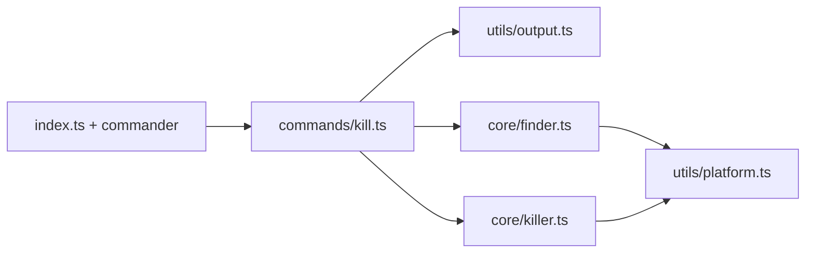

# portkill — Implementation guide

Describes the **target** architecture and implementation order aligned with [PRD.md](../PRD.md). Use this for module boundaries and data flow even before all code exists.

## Goal

Find processes listening on the given TCP port(s) and terminate them; stdout and exit codes must match PRD §5.

## Layers

| Module | Responsibility |
| --- | --- |
| `index.ts` | `commander` setup, global flags, `process.exitCode` / PRD exit codes. |
| `commands/kill.ts` | Validate ports; `--dry-run` / confirm / `--force`; call `finder` + `killer` per port; aggregate exit code. |
| `core/finder.ts` | Listeners per port: PID(s), command name when available; parse shell output here or via `platform`. |
| `core/killer.ts` | Send signal (`process.kill`); distinguish EPERM vs other errors. |
| `utils/platform.ts` | `process.platform`; macOS `lsof`, Linux `fuser` or `/proc/net/tcp`; build command lines. |
| `utils/output.ts` | PRD §5.2 one-line messages; `--verbose` extras; optional color (PRD v0.2 chalk). |

## Data flow (summary)

1. CLI parses positional ports (invalid → exit `1`).
2. Per port, `finder`: none → **not_found**; else PID list + name.
3. `--dry-run`: no signals; show what would happen (PRD-style lines).
4. Otherwise, if not `--force`, interactive confirm (stdin TTY check); then `killer` with SIGTERM (or `--signal`).
5. After all ports: any **permission denied** → exit `3`; all ports empty → exit `2`; success → `0`.

See [DATA_DICTIONARY.md](../DATA_DICTIONARY.md) for fields and outcome kinds.

## Platform implementation

| OS | Detection | Notes |
| --- | --- | --- |
| `darwin` | `lsof` with TCP + LISTEN | One PID per line in machine-friendly mode or parse table. |
| `linux` | Prefer `lsof`; else `fuser` or `/proc/net/tcp` inode → PID | Fallback when `fuser` or `lsof` missing. |

Windows is out of scope; `platform.ts` should error clearly on unsupported `process.platform`.

## Testing

- `finder` / `killer`: unit tests with mocked `child_process` or a small runner interface (Vitest).
- Optional integration: temporary listener (`node -e` + `http.createServer`) for real-port dry-run/kill — can be flaky in CI; keep optional.

## GUI (v0.4+)

- `src/gui/server.ts`: bind `127.0.0.1` only; static bundle + JSON endpoint.
- Do **not** duplicate business logic; import `core/*`. Request/response shapes: [DATA_DICTIONARY.md](../DATA_DICTIONARY.md) §HTTP API.

## Related docs

- [PRD.md](../PRD.md) — product and CLI contract
- [cli-reference.md](./cli-reference.md) — CLI cheat sheet
- [.cursor/rules/workflow.mdc](../.cursor/rules/workflow.mdc) — implementation order
