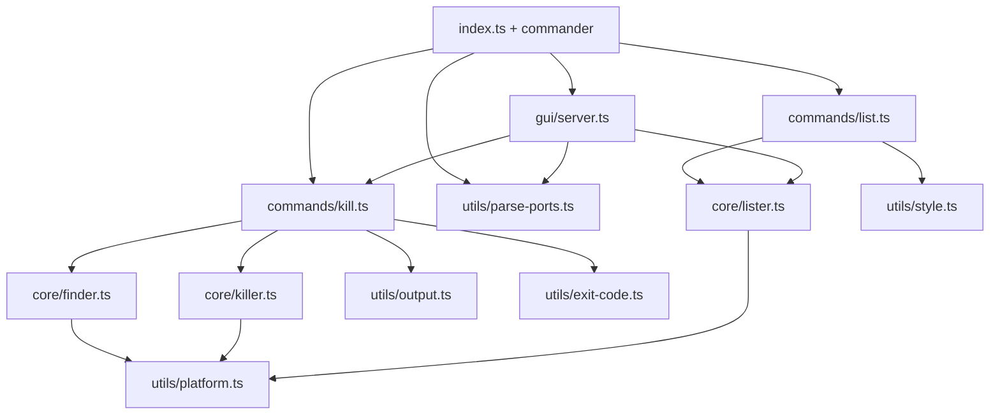

# portkill — Implementation guide

Describes the architecture and data flow aligned with [PRD.md](../PRD.md): CLI, shared core, and GUI. Layout matches **§6.2** in the PRD.

## Goal

Find processes listening on the given TCP port(s) and terminate them; stdout and exit codes must match PRD §5. **`--list`** and **`--gui`** reuse the same core and utilities where possible.

## Layers

| Module | Responsibility |
| --- | --- |
| `index.ts` | `commander` setup, global flags, routes `--list` / `--gui` vs default kill action, `process.exitCode`. |
| `types.ts` | `PortOutcome`, `ListenerProcess` — shared between kill flow and tests. |
| `utils/parse-ports.ts` | Expand positional args: single ports and inclusive ranges (`3000-3005`); used by CLI and GUI. |
| `commands/kill.ts` | Per-port `finder` + optional `killer`; `--dry-run` / confirm / `--force`; `aggregateExitCode` from outcomes. |
| `commands/list.ts` | `--list`: `listAllTcpListeners`, styled table lines via `style`. |
| `core/finder.ts` | Listeners for one port: PID(s), command name; shell output parsing. |
| `core/killer.ts` | Send signal (`process.kill`); distinguish EPERM vs other errors. |
| `core/lister.ts` | All TCP LISTEN rows (`lsof`); parse lines for `--list` and GUI. |
| `utils/platform.ts` | `process.platform`; macOS `lsof`, Linux `fuser` or `/proc/net/tcp`; command builders. |
| `utils/output.ts` | PRD §5.2 one-line messages for kill outcomes; `formatOutcomeLine`. |
| `utils/exit-code.ts` | `aggregateExitCode` from `PortOutcome[]` (permission > error > all-not-found > success). |
| `utils/style.ts` | Chalk wrappers for list rows and errors (`NO_COLOR` / TTY via chalk). |

## Data flow (summary)

### Default (kill) path

1. CLI parses positional ports via `parsePortArguments` (invalid → exit `1`).
2. Per port, `finder`: none → **not_found**; else PID list + name.
3. `--dry-run`: no signals; show what would happen (PRD-style lines).
4. Otherwise, if not `--force`, interactive confirm (stdin TTY check); then `killer` with SIGTERM (or `--signal`).
5. After all ports: `aggregateExitCode` — any **permission denied** → exit `3`; all ports empty → exit `2`; success → `0`.

### `--list` path

1. `listAllTcpListeners(platform)`; on success print styled rows or “no listeners”.

See [DATA_DICTIONARY.md](../DATA_DICTIONARY.md) for fields and outcome kinds.

## Platform implementation

| OS | Detection | Notes |
| --- | --- | --- |
| `darwin` | `lsof` with TCP + LISTEN | One PID per line in machine-friendly mode or parse table. |
| `linux` | Prefer `lsof`; else `fuser` or `/proc/net/tcp` inode → PID | Fallback when `fuser` or `lsof` missing. |

Windows is out of scope; `platform.ts` should error clearly on unsupported `process.platform`.

## Testing

- `finder` / `killer` / `lister`: unit tests with mocked `child_process` or injectable `execFile` (Vitest).
- Commands and GUI: integration-style tests under `tests/` (see PRD §6.2 file list).
- Optional: temporary listener (`node -e` + `http.createServer`) for real-port dry-run/kill — can be flaky in CI; keep optional.

## GUI

- `src/gui/server.ts`: loopback HTTP; `GET /`, `GET /api/listeners`, `POST /api/resolve`.
- `src/gui/index-html.ts`: embedded single-page UI (no Vite bundle).
- `src/gui/open-browser.ts`: `open` / `xdg-open`.
- Reuses `runKill`, `listAllTcpListeners`, `parsePortArguments`. API shapes: [DATA_DICTIONARY.md](../DATA_DICTIONARY.md) §7.

## Distribution

Publishing to **npm** only (`npm publish`) as `@burakboduroglu/portkill`. See [PRD.md](../PRD.md) §7 and [RELEASE.md](../RELEASE.md).

## Related docs

- [PRD.md](../PRD.md) — product and CLI contract
- [cli-reference.md](./cli-reference.md) — CLI cheat sheet
- [.cursor/rules/workflow.mdc](../.cursor/rules/workflow.mdc) — implementation order
