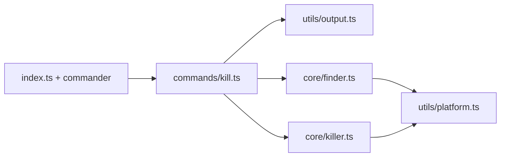

# portkill — Uygulama rehberi

Bu belge [PRD.md](../PRD.md) ile hizalı hedef mimariyi ve uygulama sırasını açıklar. Kaynak kod henüz yoksa bile modül sınırları ve veri akışı buradan takip edilir.

## Amaç

Verilen TCP port(lar)ında dinleyen süreçleri bulup sonlandırmak; çıktı ve çıkış kodları PRD §5 ile birebir uyumlu olmalıdır.

## Katmanlar

| Modül | Sorumluluk |
| --- | --- |
| `index.ts` | `commander` kurulumu, global flag’ler, `process.exit` ile PRD exit kodları. |
| `commands/kill.ts` | Port listesini doğrula; `--dry-run` / onay / `--force` akışını yönet; her port için `finder` + `killer` çağır; toplu exit kodu hesapla. |
| `core/finder.ts` | Port başına dinleyen süreç(ler): PID, mümkünse komut adı. Shell çıktısını ayrıştırma burada veya `platform` yardımıyla. |
| `core/killer.ts` | PID’ye sinyal gönderme (`kill` / `process.kill`); EPERM vs diğer hataları ayırt et. |
| `utils/platform.ts` | `process.platform`; macOS için `lsof`, Linux için `fuser` veya `/proc/net/tcp` stratejisi; komut satırlarını üretme. |
| `utils/output.ts` | PRD §5.2 tek satırlık mesajlar; `--verbose` ek detay; isteğe bağlı renk (PRD v0.2 chalk). |

## Veri akışı (özet)

1. CLI, pozisyonel port argümanlarını sayıya çevirir (geçersiz → genel hata, exit `1`).
2. Her port için `finder` çağrılır: süreç yoksa sonuç **not_found**; varsa PID listesi + isim.
3. `--dry-run`: öldürme yapılmaz; kullanıcıya ne yapılacağı gösterilir (PRD çıktı biçimi).
4. Aksi halde `--force` yoksa etkileşimli onay (stdin TTY kontrolü); sonra `killer` SIGTERM (veya `--signal`).
5. Tüm portlar işlendikten sonra: en az bir **permission denied** → exit `3`; hiçbirinde süreç yok ve bu tek başarısızlık senaryosuysa PRD’ye göre exit `2`; tam başarı → `0`.

Ayrıntılı alanlar ve sonuç türleri için [DATA_DICTIONARY.md](../DATA_DICTIONARY.md).

## Platform uygulaması

| OS | Tespit | Not |
| --- | --- | --- |
| `darwin` | `lsof -ti tcp:<port>` (+ gerekirse `-sTCP:LISTEN`) | Çıktı: satır başına PID. |
| `linux` | Öncelik `fuser -n tcp <port>` veya `/proc/net/tcp` ile inode→PID | `fuser` dağıtımda yoksa yedek yol. |

Windows kapsam dışı; `platform.ts` açıkça desteklenmeyen platformda anlamlı hata verir.

## Test stratejisi

- `finder` / `killer`: `child_process.exec` veya küçük bir “runner” arayüzü mock’lanarak birim test (Vitest).
- Entegrasyon: mümkünse geçici dinleyici (ör. `node -e` ile `http.createServer`) açıp gerçek portta dry-run ve kill senaryosu — CI’de flaky olabilir; isteğe bağlı script.

## GUI (v0.4+)

- `src/gui/server.ts`: yalnızca `127.0.0.1`, statik bundle + JSON endpoint.
- İş mantığı **paylaşılmaz** kopyalanmaz; `core/*` import edilir. İstek/yanıt şeması [DATA_DICTIONARY.md](../DATA_DICTIONARY.md) §HTTP API.

## İlgili belgeler

- [PRD.md](../PRD.md) — ürün ve CLI sözleşmesi
- [cli-reference.md](./cli-reference.md) — komut satırı özeti
- [.cursor/rules/workflow.mdc](../.cursor/rules/workflow.mdc) — geliştirme sırası
